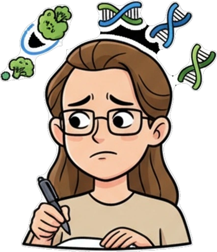
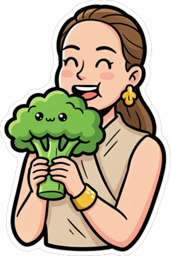

## Личное IT пространство Обрезаненко Валентины 

🧩 Стек языков: Python, SQL, C++\C#

Привет! Мой репозиторий на стадии заливки, не все проекты пока оформлены.
Понять и простить:) 

Проекты, которые на стадии заливки - 🟡, которые полностью залиты - 🟢, в разработке - 🔵.
  
Но уже сейчас можно что-то небольшое посмотреть:

###  GWAS-анализ - https://github.com/ValenTine99/GWAS_analisys (🟢)

Это пример выполнения тестового задания - нужно было провести предсказание урожайности клеточных линий, код там на питоне, применялась линейная регрессия. 

###  ИИ ассистент -  https://github.com/ValenTine99/ai_agent (🟢)

Разработка персонального ИИ ассистента через телеграмм-бот на базе n8n

###  Научная статья - https://www.mdpi.com/2075-4655/10/1/11 (🟢)

Исследование ретротранспозонов в различных типах рака. 

###  Рекомендации для правильного питания - https://github.com/ValenTine99/food_nutrition (🟡)

Скоро там что-то появится. 
